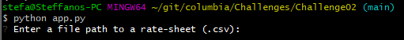
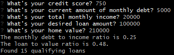
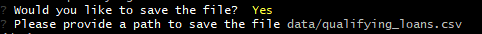
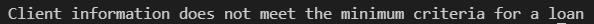

# Project Title
*The loan qualifier application is a perfect tool for a fintech startup company seeking to automate their busness proccess. The application is a recopilation of requirements by the Business Operation team to solve the day to day calculations and manual data filtering that a employee need to execute in order to verify the client's information with live bank data*

---

## Technologies

This is a python command-line interace application witch runs in python 3.7 with the following packages:

* [fire](https://github.com/google/python-fire) - For the command line interface, help page, and entrypoint.

* [questionary](https://github.com/tmbo/questionary) - For interactive user prompts and dialogs

---

## Installation Guide

In order to runn the application you need to first install the following pacakges:

```python
    pip install fire==0.3.1
    pip install questionary==1.5.2
```

---

## Usage

To use the application please do the following steps:

```
* Clone the repository in your local machine.
* Under the data folder replace the existing csv file with your own information, a file with demo information is provided.
* With python execute the following:
    python app.py
```
Upon launching the application will ask for the following prompts:

* Please provide a path to pull the bank information from:



* Please provide the client's information and the application will return the monthly debt to income ratio, the loan to value ratio and the amount of qualifying loans:



* Then the application will provide you with a choice whether to save the results in a csv file or not if so you would need to provide a path to where to save the desire information:



* If the choice is `No` the system will exit with the following messsage:


* If the client's information doesnot meet the minimum criteria the system will exit with the following message:


Finally the program will end

---

## Contributors

The loan qualifier was made by Steffano thanks to the Columiba Fintech Bootcamp tutoring team for Module 2 Challenge 02

---

## License

Columbia Fintech Bootcamp
