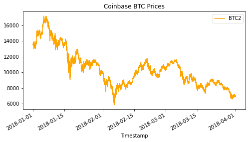

# Challenge 03
*Challenge 03 is an data analysis tool specific for arbitrage opportunities in bitcoin 2018, thanks to the historical data provided the analysis prove that the chances of getting a profitable trade by arbitrage decreases over time*

---
## Technologies

This is a jupyter notebook application witch runs in python 3.7 with the following packages:

* [pandas](https://pandas.pydata.org/) - For data analysis and manipulation.

* [pathlib](https://docs.python.org/3/library/pathlib.html) - For reading csv files.

* [matplotlib](https://matplotlib.org/) - For creating statics, animated, and interactive visualizations

---

## Installation Guide

In order to runn the application you need to first install the following pacakges:

```python
    pip install pandas
    pip install pathlib
    pip install matplotlib
```

---

## Usage

To use the tool please do the following steps:

```
* Clone the repository in your local machine.
* Under the Resources folder replace the existing csv file with your own information, a file with historical bitcoin information is provided.
* With Jupyter Notebooks execute the following:
    crypto_arbitrage.ipynb

* Run all the command lines in the same order
```
---

## Analysis Report

After the data was collected, prepared and Analyzed by the tool. I conclude the following:

### Bitstamp BTC close price
Bitstamp slice data contain 129,067 data points between 2018-01-01 to 2018-03-31


### Coinbase BTC close price
slice data contain 129,067 data points between 2018-01-01 to 2018-03-31


---

After slicing the data in two sections and overlaying the data points between the exchanges we can detect the best day to look for profitable trades

### Overlay data Jan-15 to Feb-15


### Overlay data March-01 to March-30


---
I decided to focus in 2018-01-20 to search for profitable trades, period witch I believe has more chances of making profitable trades

After calculating the spread between the close prices and dropping the trades that did not made more than 1% profit, we can see that we are left with the following:

* count    17.000000
* mean      0.011860
* min       0.010229
* max       0.016040

Which means that we have an average of 1.1% profit in 17 trades with a min of 1% and a max of 1.6%, in the following graph you can notice that the more profitable trades are at the beginning of the day and as time progresses the profitability decreases.


The total profit for the day is $2,534.22 and you can see in the next image the cumulative profit overtime


---

The above exercise was made for three different days and the beginning at the middle and at the end. As you can see in the following data point the profitable trades decreases over time

**February-20**

* count      1.0
* mean     254.0

**March-20**

* count    0.0
* mean     NaN

Concluding that we barely have any profitable trades as time progressed

---

## Contributors

The loan arbitrage analysis tool was made by Steffano thanks to the Columiba Fintech Bootcamp tutoring team for Module 3 Challenge 03

---

## License

Columbia Fintech Bootcamp