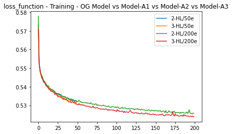
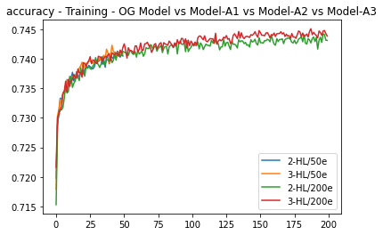

# Module 13 Report

## Overview of the Analysis

This notebook use deep neural networks algorithms to predict if the funding applications from startups that Alphabet Soup, a venture capital firm will be successful if funded.

* The data provided consist of 116 dimensions with 34 k applications. At the very end of the analysis a pca metodology was used to determin the type of data. Thanks to thise analysis it was determined that the data is linear.

* The high-level overview of the process is as follow: first the data must be clean and scale in order to split it into the training and the testing data. After the fact a structure for the deep neural network is stablish, the same model is compiled and fited with binary model. Lastly the model is saved and evaluate in a visualization graph. 

## Results

Below you will read the results of four models predicting the same data.

* Original Model Results:
  * The original model has a Loss of .56 and a Accuracy of .73

* Alternative Model 1 Results:
  * The original model has a Loss of .55 and a Accuracy of .73 

* Alternative Model 2 Results:
  * The original model has a Loss of .57 and a Accuracy of .73

* Alternative Model 3 Results:
  * The original model has a Loss of .57 and a Accuracy of .73

## Summary

After analyzing the results, We can see in the following graph that ass we increase the number of hidden nodes and the number of epochs the loss and accuracy gets better but not significally.

# Loss Graph

# Accuracy Graph

Since the accuracy of the model did not increase dramatacly I will suggest to go back with a industry specialist to review the data and explore the possibility of adding or deleting more relevant data