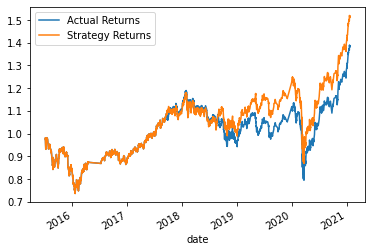
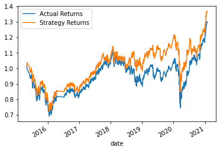
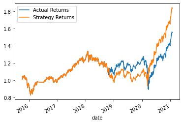
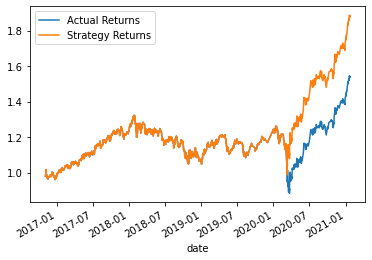
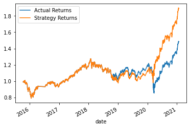
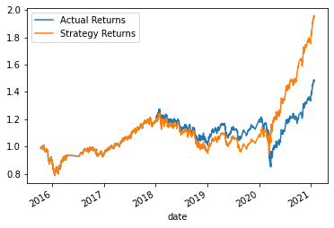
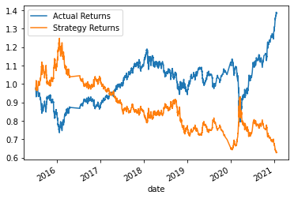
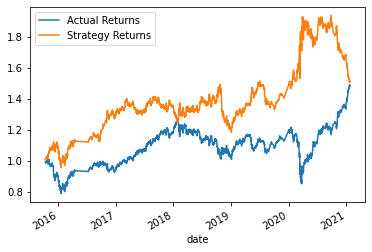
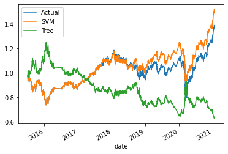
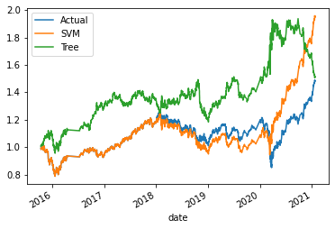

# Module 14 Report

## Overview of the Analysis

This notebook use diferent machine learning models to seek for better returns in emergin markets (OHLCV).

* The data provided consist of 6 dimensions with 4 k rows. We were provided with the date, open, high, low, close and volume of every 15 minutes from 01/21/15 to 01/22/2021

* The high-level overview of the process is as follow: first the data must be clean and scale to split it into the training and the testing data. After the fact a machine learning model is stablish, the same model is fitted and transform. Lastly the model predictions are passed to a data frame to compare them with the actual returns simulating a hold of the same stock for the same period of time. All the results were plotted for visualization purposes.

## Tuning the baseline results

The results of the different models and features tuning is shown below:

* Results for the SVM Model baseline, with a training window of 3 months:
  * The total actual cumulative return is  1.39%
  * The total strategy cumulative return is  1.52%
  * The variance is  9.42%

* Results for the SVM Model 1, with a training window of 1 month:
  * The total actual cumulative return is  1.30%
  * The total strategy cumulative return is  1.37%
  * The variance is  5.24%

* Results for the SVM Model 2, with a training window of 6 months:
  * The total actual cumulative return is  1.56%
  * The total strategy cumulative return is  1.84%
  * The variance is  18.02%

* Results for the SVM Model 3, training window of 19 months:
  * The total actual cumulative return is  1.54%
  * The total strategy cumulative return is  1.88%
  * The variance is  22.14%

Tuning the training window: *After playing around with the training window we can observe that as we increase the training window we get better returns, non the less we need to overcome an overfitting challenge since by increasing the training window the model starts replicating exactly the stock returns.*

* Results for the SVM Model 4, long window of 130 periods:
  * The total actual cumulative return is  1.49%
  * The total strategy cumulative return is  1.90%
  * The variance is  27.60%

* Results for the SVM Model 5, short window of 3 periods:
  * The total actual cumulative return is  1.49%
  * The total strategy cumulative return is  1.95%
  * The variance is  31.54%

Tuning the features (SMA short and long): *After playing around with the features I manage to tune the baseline to 31.54%. There is no relationship by increasing or decreasing the SMA windows that can be associated directly to a better performance, when you change the window the results change drastically with no relation betweeen each other.*

Tuning the sma windows: *The best results were obtain with a 6 months of training data with a short window of 3 and a long window of 130*

* Results for the Decision Tree Model 6, base features:
  * The total actual cumulative return is  1.39%
  * The total strategy cumulative return is  0.63%
  * The variance is -54.71%

* Results for the Decision Tree Model 7, tuned features:
  * The total actual cumulative return is  1.49%
  * The total strategy cumulative return is  1.57%
  * The variance is  5.67%

## Comparison between models

## Conclusion

After analyzing the results, We can see in the following graph that the Decision tree model was much better prediction the sell signals, so this model perform much better in this market escenarios nontheless it has an average perfomance in the buyin signals. A combination of bouth models would be much better.