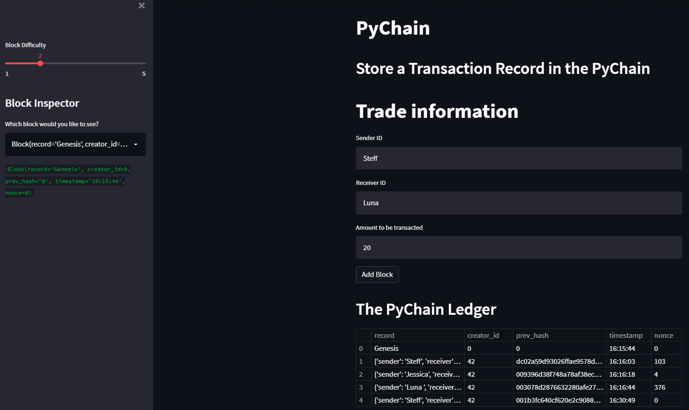
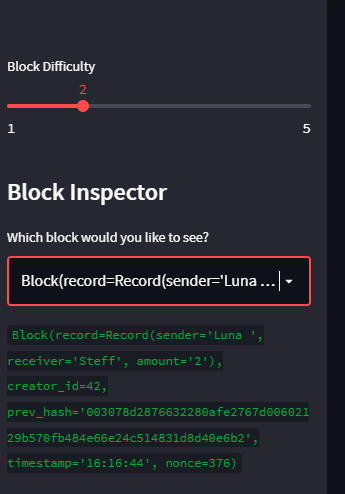

# Pychain - Challenge 18
*This app is a blockchain-based ledger system with a web interface that validates the integrity of the data.*

---

## Technologies

This is a python file witch runs in python 3.7 with the following packages:

* [streamlit](https://streamlit.io/) - For streamlit.

---

## Installation Guide

In order to runn the tool you need to first install the following pacakges:

```python
    pip install streamlit
```

---

## Usage

To use just run it in the command line as follow "streamlit run pychain.py"

---

## Screenshoots

The following screenshoots will provide an example of the ledger and webpage created for this project.






---

## Contributors

The python file was made by Steffano thanks to the Columiba Fintech Bootcamp tutoring team for Module 6 Challenge 06

---

## License

Columbia Fintech Bootcamp
