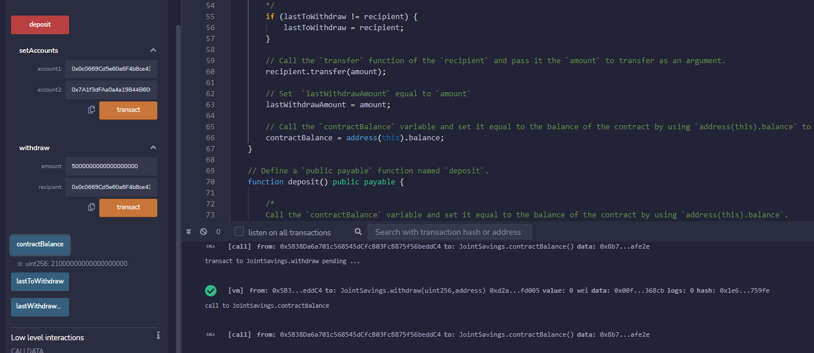

# Crypto joint saving account - Challenge 20
*This smart contract seeks to automate the creation of a joint saving account. We will stablish two accounts that would be able to control the joint account by providing basic functions like deposit and withdraw funds from the smart contract.*

---

## Technologies

This is a solidity file witch runs in 0.5.0 version. The smart contract has been compile and deploy in  Remix IDE with a JavaScript VM for testing porpuses.

---

## Installation Guide

No installation require since Remix IDE is a web app

---

## Usage

To use first you need compile and deploy the contract, after the fact please interact with the coded functions to deposit or withdraw ETH as desire"

---

## Screenshoots

The following screenshoots will provide an example of the functions results.

*First Transaction*

*Second Transaction*

*Third Transaction*

*Fourth Transaction*

*Set Dummy Accounts*

*Withdraw Account One*

*Withdraw Account Two*

*Last to Withdraw Account and Amount*

---

## Contributors

The solidity file was made by Steffano thanks to the Columiba Fintech Bootcamp tutoring team for Module 20 Challenge 20

---

## License

Columbia Fintech Bootcamp
